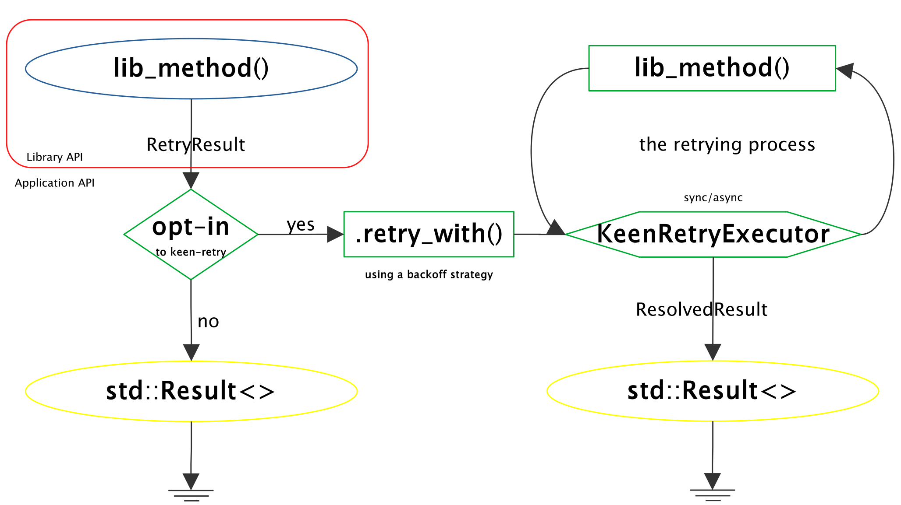
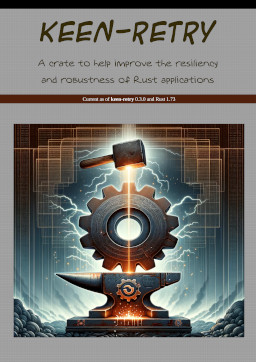

# keen-retry

## Introduction

The `keen-retry` crate is designed to provide a zero-cost, flexible, and robust way to implement retry logic in Rust applications, while also
supporting adding resiliency to libraries. Whether you are developing an API, a high-performance system, a distributed application, or a simple
tool, `keen-retry` offers a comprehensive set of features to handle transient failures gracefully, ensuring your application remains resilient,
reliable and is able to provide rich diagnostic messages, indispensable for addressing the root cause of failures.

## Features

  -  **Zero-Cost Abstraction**: Leverages Rust's powerful type system and compile-time optimizations to offer retry capabilities with no runtime overhead.
  -  **Clear Error Discrimination**: Retrying operations that fail due to non-transient errors is futile, can waste resources and may ruin the application performance.
  -  **Instrumentation and Logging**: Comprehensive logging and instrumentation features for observing and debugging retry operations.
  -  **Composable Retry Logic**: Easily chainable and composable retry operations, allowing for clean and maintainable code.
  -  **Async/Await Support**: First-class support for asynchronous programming, compatible with Tokio and other async runtimes.
  -  **Flexible Backoff Strategies**: Includes various backoff strategies, from simple constant delays to sophisticated exponential backoff with jitter, suitable for different scenarios and needs.

## Quick Start

### Integrate your Library / API

The first step is to have every retryable operation from your Library or API returning the enriched `RetryResult` type, which clearly discriminates between `Ok`, `Fatal` and `Transient` variants:

```rust
/// Wrapper around [Self::connect_to_server_raw()], enabling `keen-retry` on it
pub async fn connect_to_server(&self) -> RetryProcedureResult<ConnectionErrors> {
  self.connect_to_server_raw().await
    .map_or_else(|error| match error.is_fatal() {
                   true  => RetryResult::Fatal     { input: (), error },
                   false => RetryResult::Transient { input: (), error },
                 },
                 |_| RetryResult::Ok { reported_input: (), output: () })
}
```

### Usage

Now, in the application, you may use it via the zero-cost functional API:
```rust
let resolved = connect_to_server()
    .retry_with(|_| connect_to_server())
    .<one-of-the-backoff-strategies>(...)
    .<instrumentation-facilities>(...);
```

### The `keen-retry` Diagram




For more details, please refer to `tests/use_cases.rs`, which contains advanced
demonstrations such as how to add a fully fledged instrumentation (as seen in production applications),
how to compose nested retry logics and how to implement the versatile "Partial Completion with Continuation
Closure" design pattern.

## Performance Analysis

`keen-retry` has been rigorously benchmarked to ensure it adheres to the zero-cost abstraction principle, crucial in systems programming.
Our benchmarks, available at `benches/zero_cost_abstractions.rs`, demonstrate the efficiency of the crate.


## The Book

For a deep dive into the applicable Design Patterns, principles, strategies, and best practices for using `keen-retry` effectively,
be sure to explore our companion [keen-retry crate's Book](docs/keen-retry-book.pdf), which serves as a definitive guide, providing insights and practical
examples to harness the full potential of `keen-retry` in various software development scenarios.

[](https://archive.org/download/keen-retry-book/keen-retry-book.pdf)
